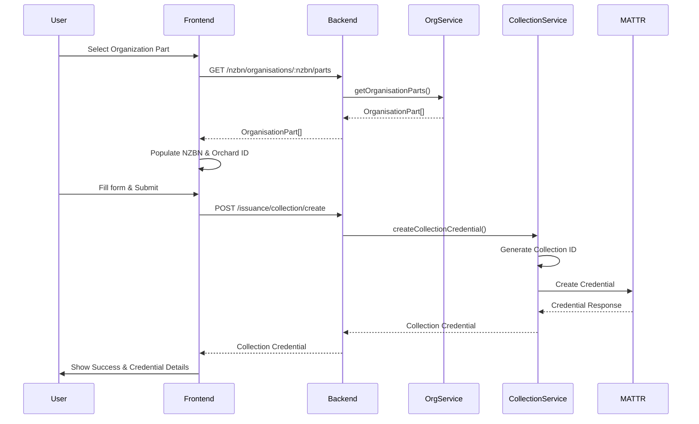

# Harvest Collection Credential Implementation

## Overview

Create a harvest collection credential system that integrates with the MATTR platform. The implementation will support the creation of collection credentials with all required harvest data fields, including bin identifiers, row identifiers, harvest timestamps, picker information, and organization details.

## Architecture

The implementation will extend the existing issuance module with a modular structure to support multiple credential types:

```
backend/src/issuance/
├── collection-credential/          # New subfolder for collection credentials
│   ├── dto/
│   │   ├── create-collection-credential.dto.ts
│   │   └── collection-credential-response.dto.ts
│   ├── interfaces/
│   │   └── collection-credential.interface.ts
│   ├── services/
│   │   ├── collection-credential.service.ts
│   │   └── collection-id-generator.service.ts
│   └── collection-credential.controller.ts
├── issuance.service.ts             # Existing generic service
└── issuance.controller.ts         # Existing controller

frontend/src/
├── app/
│   └── issuance/
│       └── collection/            # New route for collection credentials
│           ├── page.tsx            # List/create collection credentials
│           └── [id]/
│               └── page.tsx        # Collection credential details
├── components/
│   └── issuance/
│       └── collection/             # New components folder
│           ├── CollectionCredentialForm.tsx
│           ├── CollectionCredentialList.tsx
│           └── OrganisationPartSelector.tsx
└── types/
    └── collection-credential.types.ts
```

## Implementation Details

### 1. Backend - Collection Credential Module

#### 1.1 Collection ID Generator Service

**File:** `backend/src/issuance/collection-credential/services/collection-id-generator.service.ts`

- Generate Collection IDs in format: `COL-YYYYMMDD-XXXXXX`
- Use date-based prefix (YYYYMMDD)
- Generate 6-digit sequential number (000001-999999)
- Store sequence state (could use Redis or database for production)
- For demo, use in-memory counter with date-based reset

#### 1.2 Collection Credential DTOs

**File:** `backend/src/issuance/collection-credential/dto/create-collection-credential.dto.ts`

Define DTO with validation for all required fields:

- `binIdentifier`: string (e.g., "BIN-20250110-001")
- `rowIdentifier`: string (e.g., "9429000001001-ROW-AA")
- `harvestStartDatetime`: ISO 8601 datetime string
- `harvestEndDatetime`: ISO 8601 datetime string (optional initially)
- `pickerId`: string (Employee ID)
- `pickerName`: string
- `nzbn`: string (13 digits)
- `orchardId`: string
- `collectionId`: string (auto-generated if not provided)
- `recipientDid`: string (optional)
- `recipientEmail`: string (optional)

#### 1.3 Collection Credential Service

**File:** `backend/src/issuance/collection-credential/services/collection-credential.service.ts`

- Inject `IssuanceService` for MATTR API calls
- Inject `CollectionIdGeneratorService` for ID generation
- Inject `OrganisationsService` to validate/fetch organization part data
- Methods:
  - `createCollectionCredential(dto)`: Validate data, generate Collection ID if needed, call MATTR API
  - `getCollectionCredential(id)`: Retrieve credential details
  - `updateCollectionCredential(id, dto)`: Update credential (if harvest end time needs to be set)
  - `listCollectionCredentials(filters)`: List all collection credentials

#### 1.4 Collection Credential Controller

**File:** `backend/src/issuance/collection-credential/collection-credential.controller.ts`

Endpoints:

- `POST /issuance/collection/create` - Create new collection credential
- `GET /issuance/collection/:id` - Get credential details
- `PUT /issuance/collection/:id` - Update credential (e.g., set harvest end time)
- `GET /issuance/collection` - List all collection credentials (with optional filters)
- `POST /issuance/collection/:id/issue` - Issue credential via MATTR

#### 1.5 Module Registration

**File:** `backend/src/issuance/issuance.module.ts`

- Import `CollectionCredentialModule` as a sub-module
- Export `CollectionCredentialService` if needed by other modules

**File:** `backend/src/issuance/collection-credential/collection-credential.module.ts` (new)

- Register controller, services, and dependencies

### 2. Frontend - Collection Credential UI

#### 2.1 TypeScript Types

**File:** `frontend/src/types/collection-credential.types.ts`

Define interfaces matching backend DTOs:

- `CollectionCredential`
- `CreateCollectionCredentialRequest`
- `CollectionCredentialFormData`

#### 2.2 API Client

**File:** `frontend/src/lib/api/collection-credential.api.ts` (new)

API functions:

- `createCollectionCredential(data)`
- `getCollectionCredential(id)`
- `updateCollectionCredential(id, data)`
- `listCollectionCredentials(filters?)`
- `issueCollectionCredential(id)`

#### 2.3 Organisation Part Selector Component

**File:** `frontend/src/components/issuance/collection/OrganisationPartSelector.tsx`

- Dropdown/search to select organization part
- On selection, populate:
  - NZBN (from organization part)
  - Orchard ID (from organization part metadata or custom-data)
- Display selected organization part details

#### 2.4 Collection Credential Form Component

**File:** `frontend/src/components/issuance/collection/CollectionCredentialForm.tsx`

Form fields:

- Organisation Part Selector (integrated)
- Bin Identifier (text input, with RFID scan simulation)
- Row Identifier (text input, with RFID scan simulation)
- Harvest Start Datetime (datetime picker)
- Harvest End Datetime (datetime picker, optional initially)
- Picker ID (text input, with wallet/scan simulation)
- Picker Name (text input, auto-populated from picker ID if possible)
- Collection ID (read-only, auto-generated)
- Recipient DID/Email (optional)

Validation:

- All required fields must be filled
- Datetime validation (end must be after start)
- NZBN format validation (13 digits)

#### 2.5 Collection Credential List Component

**File:** `frontend/src/components/issuance/collection/CollectionCredentialList.tsx`

- Display list of collection credentials
- Show: Collection ID, Bin ID, Row ID, Harvest dates, Status, Picker name
- Actions: View details, Issue credential, Update (if pending)

#### 2.6 Collection Credential Pages

**File:** `frontend/src/app/issuance/collection/page.tsx`

- Main page with list and create functionality
- Toggle between list view and create form
- Handle form submission and credential creation

**File:** `frontend/src/app/issuance/collection/[id]/page.tsx`

- Detail view for a specific collection credential
- Show all credential data
- Allow updating harvest end time if not set
- Issue credential button

### 3. Integration Points

#### 3.1 Organization Parts Integration

- Use existing `OrganisationsService` to fetch organization parts
- Extract NZBN and Orchard ID from selected organization part
- Orchard ID may be stored in organization part's `custom-data` or metadata
- Add API endpoint: `GET /nzbn/organisations/:nzbn/parts` (already exists)

#### 3.2 MATTR Integration

- Use existing `IssuanceService.createCredential()` method
- Template ID: `"harvest-collection-v1"` (placeholder)
- Map collection credential data to MATTR credential format
- Handle MATTR API responses and errors

### 4. Data Flow



### 5. Key Implementation Notes

1. **Collection ID Generation**: 

   - Format: `COL-YYYYMMDD-XXXXXX`
   - Use date-based prefix to reset sequence daily
   - For demo, use in-memory counter (Redis/database for production)

2. **Harvest End Time**: 

   - Initially optional (can be set when collection completes)
   - Allow updating via PUT endpoint

3. **Organization Part Integration**:

   - Fetch organization parts for the selected NZBN
   - Extract Orchard ID from organization part metadata
   - If Orchard ID not found in metadata, may need to add it to organization part structure

4. **MATTR Template**:

   - Use placeholder template ID: `"harvest-collection-v1"`
   - Structure credential data according to MATTR requirements
   - All fields should be included in credentialData payload

5. **Error Handling**:

   - Validate all required fields
   - Handle MATTR API errors gracefully
   - Provide user-friendly error messages

## Files to Create/Modify

### Backend

- `backend/src/issuance/collection-credential/dto/create-collection-credential.dto.ts` (new)
- `backend/src/issuance/collection-credential/dto/collection-credential-response.dto.ts` (new)
- `backend/src/issuance/collection-credential/interfaces/collection-credential.interface.ts` (new)
- `backend/src/issuance/collection-credential/services/collection-id-generator.service.ts` (new)
- `backend/src/issuance/collection-credential/services/collection-credential.service.ts` (new)
- `backend/src/issuance/collection-credential/collection-credential.controller.ts` (new)
- `backend/src/issuance/collection-credential/collection-credential.module.ts` (new)
- `backend/src/issuance/issuance.module.ts` (modify - import CollectionCredentialModule)

### Frontend

- `frontend/src/types/collection-credential.types.ts` (new)
- `frontend/src/lib/api/collection-credential.api.ts` (new)
- `frontend/src/components/issuance/collection/OrganisationPartSelector.tsx` (new)
- `frontend/src/components/issuance/collection/CollectionCredentialForm.tsx` (new)
- `frontend/src/components/issuance/collection/CollectionCredentialList.tsx` (new)
- `frontend/src/app/issuance/collection/page.tsx` (new)
- `frontend/src/app/issuance/collection/[id]/page.tsx` (new)