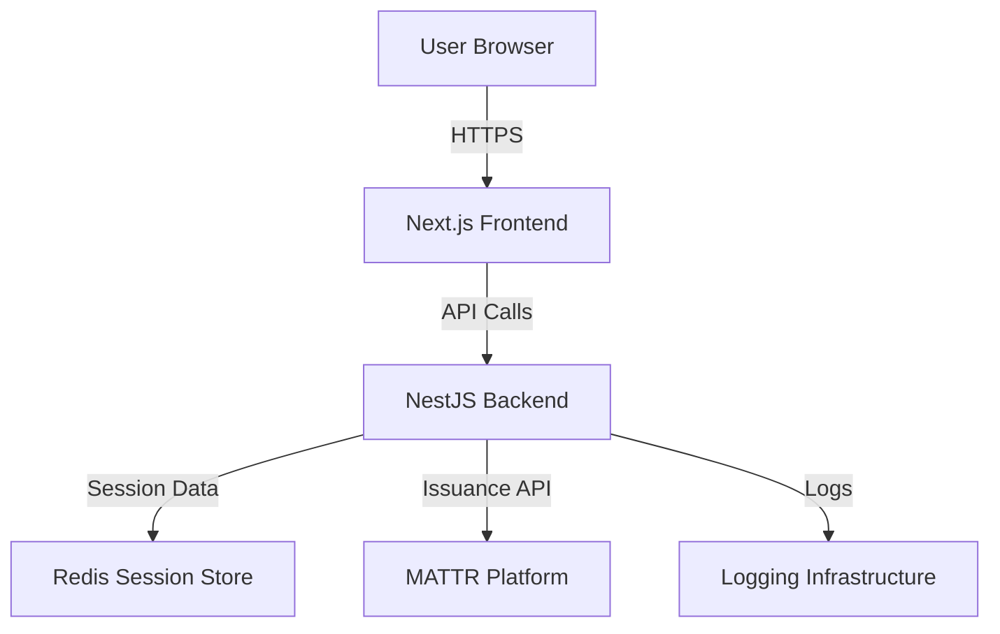

# MATTR Issuance Demo Application - Architecture Plan

## Architecture Overview

This application follows a clear separation between frontend and backend:

- **Frontend (Next.js)**: Handles UI/UX, makes API calls to backend only
- **Backend (NestJS)**: All external API integrations (MATTR platform), session management, authentication, and business logic



## Project Structure

```
zespri-demo/
├── backend/                          # NestJS Backend
│   ├── src/
│   │   ├── main.ts                  # Application entry point
│   │   ├── app.module.ts            # Root module
│   │   ├── config/                  # Configuration management
│   │   │   ├── config.module.ts
│   │   │   ├── configuration.ts     # Config schema & validation
│   │   │   └── config.service.ts    # Config service
│   │   ├── auth/                    # Authentication module
│   │   │   ├── auth.module.ts
│   │   │   ├── auth.controller.ts   # Login, logout endpoints
│   │   │   ├── auth.service.ts      # Auth business logic
│   │   │   ├── strategies/          # Passport strategies
│   │   │   │   └── jwt.strategy.ts
│   │   │   ├── guards/              # Auth guards
│   │   │   │   ├── jwt-auth.guard.ts
│   │   │   │   └── roles.guard.ts
│   │   │   └── decorators/          # Custom decorators
│   │   │       └── public.decorator.ts
│   │   ├── session/                 # Session management module
│   │   │   ├── session.module.ts
│   │   │   ├── session.service.ts   # Session CRUD operations
│   │   │   ├── session.controller.ts
│   │   │   └── interfaces/          # Session interfaces
│   │   │       └── session.interface.ts
│   │   ├── issuance/                # MATTR Issuance module
│   │   │   ├── issuance.module.ts
│   │   │   ├── issuance.controller.ts
│   │   │   ├── issuance.service.ts  # MATTR API integration
│   │   │   ├── dto/                 # Data Transfer Objects
│   │   │   │   ├── create-credential.dto.ts
│   │   │   │   └── issue-credential.dto.ts
│   │   │   └── interfaces/
│   │   │       └── matt-api.interface.ts
│   │   ├── logger/                  # Logging module
│   │   │   ├── logger.module.ts
│   │   │   ├── logger.service.ts    # Centralized logging service
│   │   │   ├── interceptors/        # HTTP logging interceptor
│   │   │   │   └── logging.interceptor.ts
│   │   │   └── middleware/          # Request logging middleware
│   │   │       └── logger.middleware.ts
│   │   ├── common/                  # Shared utilities
│   │   │   ├── filters/             # Exception filters
│   │   │   │   └── http-exception.filter.ts
│   │   │   ├── interceptors/        # Transform interceptor
│   │   │   │   └── transform.interceptor.ts
│   │   │   └── decorators/
│   │   │       └── current-user.decorator.ts
│   │   └── users/                   # User management (optional)
│   │       ├── users.module.ts
│   │       ├── users.service.ts
│   │       └── users.controller.ts
│   ├── test/                        # Test files
│   ├── .env.example                 # Environment variables template
│   ├── .env                         # Environment variables (gitignored)
│   ├── nest-cli.json                # NestJS CLI config
│   ├── package.json
│   ├── tsconfig.json                # TypeScript config
│   └── tsconfig.build.json
│
├── frontend/                        # Next.js Frontend
│   ├── src/
│   │   ├── app/                     # App Router (Next.js 13+)
│   │   │   ├── layout.tsx           # Root layout
│   │   │   ├── page.tsx             # Home page
│   │   │   ├── login/
│   │   │   │   └── page.tsx         # Login page
│   │   │   ├── dashboard/
│   │   │   │   └── page.tsx         # Dashboard (protected)
│   │   │   └── issuance/
│   │   │       ├── page.tsx         # Issuance page
│   │   │       └── [id]/
│   │   │           └── page.tsx     # Credential details
│   │   ├── components/              # React components
│   │   │   ├── ui/                  # Reusable UI components
│   │   │   │   ├── Button.tsx
│   │   │   │   ├── Input.tsx
│   │   │   │   └── Card.tsx
│   │   │   ├── layout/              # Layout components
│   │   │   │   ├── Header.tsx
│   │   │   │   ├── Sidebar.tsx
│   │   │   │   └── Footer.tsx
│   │   │   └── issuance/            # Issuance-specific components
│   │   │       ├── CredentialForm.tsx
│   │   │       └── CredentialList.tsx
│   │   ├── lib/                     # Utility libraries
│   │   │   ├── api/                 # API client
│   │   │   │   ├── client.ts        # Axios instance with interceptors
│   │   │   │   ├── auth.api.ts      # Auth API calls
│   │   │   │   ├── issuance.api.ts  # Issuance API calls
│   │   │   │   └── types.ts         # API response types
│   │   │   ├── auth/                # Auth utilities
│   │   │   │   ├── token.ts         # Token management
│   │   │   │   └── session.ts       # Session handling
│   │   │   └── utils/               # General utilities
│   │   │       └── constants.ts
│   │   ├── hooks/                   # Custom React hooks
│   │   │   ├── useAuth.ts           # Authentication hook
│   │   │   └── useApi.ts            # API call hook
│   │   ├── context/                 # React Context providers
│   │   │   └── AuthContext.tsx      # Auth context provider
│   │   ├── types/                   # TypeScript types
│   │   │   ├── auth.types.ts
│   │   │   └── issuance.types.ts
│   │   └── styles/                  # Global styles
│   │       └── globals.css
│   ├── public/                      # Static assets
│   ├── .env.local.example           # Frontend env template
│   ├── .env.local                   # Frontend env (gitignored)
│   ├── next.config.js               # Next.js config
│   ├── package.json
│   ├── tsconfig.json
│   └── tailwind.config.js           # Tailwind CSS config (optional)
│
├── .gitignore
├── README.md
└── docker-compose.yml               # Docker setup for Redis, etc.
```

## Key Components

### Backend (NestJS)

1. **Configuration Module** (`backend/src/config/`)

   - Environment-based configuration (`.env` files)
   - Validation using `@nestjs/config` and `class-validator`
   - Configurable session storage adapter
   - MATTR API credentials configuration

2. **Authentication Module** (`backend/src/auth/`)

   - JWT-based authentication
   - Passport.js integration
   - Login/logout endpoints
   - Token refresh mechanism
   - Protected route guards

3. **Session Module** (`backend/src/session/`)

   - Redis-based session storage (configurable)
   - Session service with CRUD operations
   - Session middleware integration
   - Support for multiple storage adapters (Redis, memory, database)

4. **Issuance Module** (`backend/src/issuance/`)

   - MATTR Platform API integration
   - Credential issuance endpoints
   - Credential status checking
   - DTOs for request/response validation

5. **Logger Module** (`backend/src/logger/`)

   - Winston or Pino logging
   - Log levels configuration
   - Request/response logging interceptor
   - Structured logging format
   - Log rotation and file output

6. **Common Module** (`backend/src/common/`)

   - Exception filters for error handling
   - Response transformation interceptor
   - Custom decorators (e.g., `@CurrentUser()`)

### Frontend (Next.js)

1. **API Client** (`frontend/src/lib/api/`)

   - Axios instance with base URL configuration
   - Request/response interceptors for auth tokens
   - Error handling
   - Type-safe API functions

2. **Authentication** (`frontend/src/lib/auth/`, `frontend/src/context/`)

   - JWT token storage (localStorage or httpOnly cookies)
   - Auth context provider
   - Protected route middleware
   - Login/logout flows

3. **UI Components** (`frontend/src/components/`)

   - Reusable UI components
   - Issuance-specific components
   - Layout components

4. **Pages** (`frontend/src/app/`)

   - App Router structure (Next.js 13+)
   - Login page
   - Dashboard/Home page
   - Issuance management pages

## Technology Stack

### Backend

- **NestJS** - Progressive Node.js framework
- **TypeScript** - Type safety
- **Passport.js** - Authentication strategies
- **@nestjs/jwt** - JWT token handling
- **@nestjs/config** - Configuration management
- **ioredis** - Redis client
- **@nestjs/redis** - NestJS Redis module
- **winston** or **pino** - Logging
- **axios** - HTTP client for MATTR API
- **class-validator** / **class-transformer** - DTO validation

### Frontend

- **Next.js 14+** (App Router) - React framework
- **TypeScript** - Type safety
- **React** - UI library
- **Axios** - HTTP client
- **Tailwind CSS** (optional) - Styling
- **React Hook Form** (optional) - Form handling

### Infrastructure

- **Redis** - Session storage
- **Docker** (optional) - Containerization

## Configuration Files

### Backend Configuration

- `.env` file will contain:
  - `PORT` - Backend server port
  - `JWT_SECRET` - JWT signing secret
  - `JWT_EXPIRATION` - Token expiration time
  - `REDIS_HOST` - Redis host
  - `REDIS_PORT` - Redis port
  - `MATTR_API_URL` - MATTR Platform API URL
  - `MATTR_API_KEY` - MATTR API key
  - `SESSION_STORE_TYPE` - Session storage type (redis/memory/database)
  - `LOG_LEVEL` - Logging level (debug/info/warn/error)

### Frontend Configuration

- `.env.local` file will contain:
  - `NEXT_PUBLIC_API_URL` - Backend API URL
  - `NEXT_PUBLIC_APP_NAME` - Application name

## Data Flow

1. **Authentication Flow**:

   - User logs in through frontend
   - Frontend sends credentials to `/auth/login`
   - Backend validates, generates JWT, stores session in Redis
   - Backend returns JWT token
   - Frontend stores token and includes in subsequent requests

2. **Issuance Flow**:

   - Authenticated user requests credential issuance
   - Frontend sends request to `/issuance/issue`
   - Backend validates request, logs the action
   - Backend calls MATTR Platform API
   - Backend returns response to frontend
   - Frontend displays result

3. **Session Management**:

   - Backend validates JWT on protected routes
   - Session data stored in Redis with TTL
   - Session can be retrieved/updated through session service
   - Logout clears session from Redis

## Next Steps

After approval, the implementation will:

1. Set up backend NestJS project structure
2. Set up frontend Next.js project structure
3. Configure basic modules (config, auth, session, logger, issuance)
4. Set up Docker Compose for Redis
5. Create environment variable templates
6. Implement basic authentication flow
7. Create logging infrastructure
8. Set up session management with Redis
9. Create basic frontend structure with API client
10. Add README with setup instructions