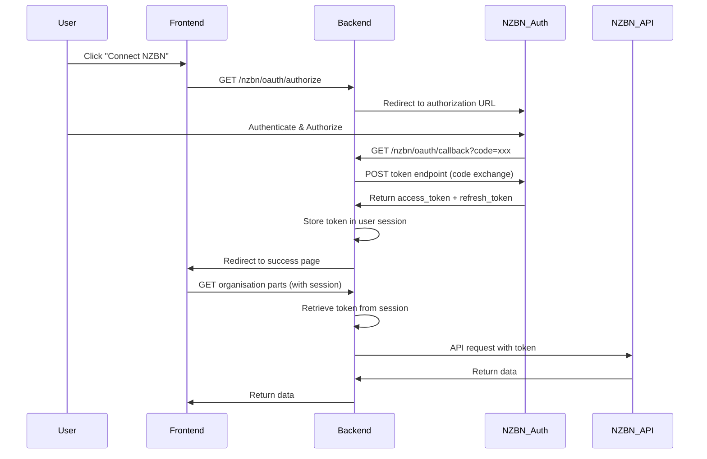

# OAuth 2.0 Three-Legged Authentication for NZBN API

## Overview

Implement the complete OAuth 2.0 Authorization Code flow for NZBN API. The system will redirect users to NZBN's authorization endpoint, handle the callback with authorization code, exchange it for an access token, and store the token in the user's session for automatic use in API requests.

## Architecture Flow



## Implementation Details

### 1. Configuration

**Files to modify:**

- `backend/src/config/configuration.ts`
- `backend/src/config/config.service.ts`

**Add configuration:**

```typescript
nzbn: {
  apiUrl: process.env.NZBN_API_URL || 'https://api.business.govt.nz/sandbox',
  oauth: {
    authorizeUrl: process.env.NZBN_OAUTH_AUTHORIZE_URL || 'https://api.business.govt.nz/oauth2/v2.0/authorize',
    tokenUrl: process.env.NZBN_OAUTH_TOKEN_URL || 'https://api.business.govt.nz/oauth2/v2.0/token',
    clientId: process.env.NZBN_OAUTH_CLIENT_ID || '',
    redirectUri: process.env.NZBN_OAUTH_REDIRECT_URI || 'http://localhost:3000/nzbn/oauth/callback',
    scope: process.env.NZBN_OAUTH_SCOPE || 'https://api.business.govt.nz/sandbox/NZBNCO:manage offline_access',
    policy: 'b2c_1a_api_consent_susi', // Fixed value per user requirement
  }
}
```

**Note:** The authorize URL provided seems to have a duplicate domain (`api.business.govt.nz/api.business.govt.nz`). Should use `https://api.business.govt.nz/oauth2/v2.0/authorize` - will clarify in implementation.

### 2. Backend OAuth Service

**File:** `backend/src/nzbn/organisations/services/nzbn-oauth.service.ts`

Create a service that:

- Generates authorization URLs with proper parameters
- Exchanges authorization code for access token
- Handles token refresh (if refresh token available)
- Stores tokens securely
- Retrieves tokens from session

**Methods:**

- `getAuthorizationUrl(state: string): string` - Generate authorization URL
- `exchangeCodeForToken(code: string): Promise<OAuthTokenResponse>` - Exchange code for token
- `refreshToken(refreshToken: string): Promise<OAuthTokenResponse>` - Refresh access token

**Interfaces:**

```typescript
interface OAuthTokenResponse {
  access_token: string;
  refresh_token?: string;
  expires_in?: number;
  token_type?: string;
}
```

### 3. Backend OAuth Controller

**File:** `backend/src/nzbn/organisations/oauth.controller.ts`

**Endpoints:**

#### GET `/nzbn/oauth/authorize`

- Protected with JWT auth guard
- Generate state parameter (CSRF protection)
- Store state in session
- Redirect user to NZBN authorization URL

#### GET `/nzbn/oauth/callback`

- Public endpoint (called by NZBN)
- Receive authorization code and state
- Validate state from session
- Exchange code for token
- Store token in user's session
- Redirect to frontend success page

**Flow:**

1. User clicks "Connect NZBN" in frontend
2. Frontend calls `/nzbn/oauth/authorize`
3. Backend redirects to NZBN with authorization URL
4. User authenticates on NZBN
5. NZBN redirects to `/nzbn/oauth/callback?code=xxx&state=xxx`
6. Backend validates state, exchanges code for token
7. Backend stores token in session (using sessionId from state)
8. Backend redirects to frontend callback page

### 4. Session Storage for OAuth Tokens

**File:** `backend/src/session/interfaces/session.interface.ts`

Update ISession interface to include OAuth token:

```typescript
export interface ISession {
  userId: string;
  email: string;
  createdAt: Date;
  expiresAt: Date;
  data?: Record<string, any>;
  nzbnOAuthToken?: {
    access_token: string;
    refresh_token?: string;
    expires_at?: Date; // Calculated from expires_in
  };
}
```

**Alternative approach:** Store in `data` field:

- Store as `data.nzbnOAuthToken` to maintain backward compatibility

### 5. Update Organisations Service & Controller

**Files:**

- `backend/src/nzbn/organisations/organisations.service.ts`
- `backend/src/nzbn/organisations/organisations.controller.ts`

**Changes:**

- Remove OAuth token from request parameters
- Get token from user session instead
- Update service methods to accept sessionId instead of token
- Controller extracts sessionId from JWT, retrieves session, gets token
- If no token, return 401 with appropriate message

**New method in OrganisationsService:**

```typescript
async getOrganisationPartsFromSession(
  nzbn: string,
  sessionId: string,
  sessionService: SessionService
): Promise<OrganisationPart[]>
```

### 6. Update OAuth Token Guard

**File:** `backend/src/nzbn/organisations/guards/oauth-token.guard.ts`

**Changes:**

- Remove requirement for Authorization header with OAuth token
- Ensure user is authenticated (JWT guard should handle this)
- Check session for OAuth token
- If missing, throw error with message to initiate OAuth flow

**Or:** Create new guard that checks for OAuth token in session

### 7. Frontend OAuth Integration

**Files to create/modify:**

#### `frontend/src/app/nzbn/oauth/callback/page.tsx`

- Handle OAuth callback redirect from backend
- Display success/error message
- Redirect to organisation parts page

#### Update `frontend/src/app/nzbn/organisations/[nzbn]/parts/page.tsx`

- Remove OAuth token input form
- Add "Connect NZBN" button if no token
- Button links to `/nzbn/oauth/authorize` endpoint
- Remove `oauthTokenStorage` usage
- Remove token from API calls

#### Update `frontend/src/lib/api/organisations.api.ts`

- Remove OAuth token parameter from all methods
- Use standard apiClient (with JWT auth)
- Backend will handle OAuth token from session

### 8. State Management for OAuth Flow

**Backend approach:**

- Generate random state string (UUID)
- Store state → sessionId mapping in Redis/memory (short TTL, e.g., 10 minutes)
- Include state in authorization URL
- Validate state in callback
- Map state back to sessionId to store token

**State storage service:**

- In-memory Map or Redis with short TTL
- Key: state, Value: sessionId

## Key Design Decisions

1. **Token Storage:** Store OAuth tokens in session data field for backward compatibility
2. **State Management:** Use short-lived state store to map OAuth state to sessionId
3. **Token Refresh:** Store refresh token for future token refresh implementation
4. **Error Handling:** Clear error messages when OAuth token is missing
5. **Security:** State parameter for CSRF protection, validate in callback

## Environment Variables

```env
NZBN_API_URL=https://api.business.govt.nz/sandbox
NZBN_OAUTH_AUTHORIZE_URL=https://api.business.govt.nz/oauth2/v2.0/authorize
NZBN_OAUTH_TOKEN_URL=https://api.business.govt.nz/oauth2/v2.0/token
NZBN_OAUTH_CLIENT_ID=your-client-id
NZBN_OAUTH_REDIRECT_URI=http://localhost:3000/nzbn/oauth/callback
NZBN_OAUTH_SCOPE=https://api.business.govt.nz/sandbox/NZBNCO:manage offline_access
```

## User Flow

1. User navigates to organisation parts page
2. If no OAuth token in session, show "Connect NZBN" button
3. User clicks button → redirected to backend `/nzbn/oauth/authorize`
4. Backend redirects to NZBN authorization page
5. User authenticates and authorizes on NZBN
6. NZBN redirects to backend callback with code
7. Backend exchanges code for token, stores in session
8. Backend redirects to frontend callback page
9. Frontend callback page redirects to organisation parts page
10. Organisation parts page now has token in session, API calls work

## Files to Create/Modify

### Backend

- `backend/src/nzbn/organisations/services/nzbn-oauth.service.ts` (new)
- `backend/src/nzbn/organisations/oauth.controller.ts` (new)
- `backend/src/nzbn/organisations/organisations.module.ts` (update)
- `backend/src/nzbn/organisations/organisations.service.ts` (update)
- `backend/src/nzbn/organisations/organisations.controller.ts` (update)
- `backend/src/nzbn/organisations/guards/oauth-token.guard.ts` (update or replace)
- `backend/src/config/configuration.ts` (update)
- `backend/src/config/config.service.ts` (update)

### Frontend

- `frontend/src/app/nzbn/oauth/callback/page.tsx` (new)
- `frontend/src/app/nzbn/organisations/[nzbn]/parts/page.tsx` (update)
- `frontend/src/lib/api/organisations.api.ts` (update)
- `frontend/src/lib/auth/oauth-token.ts` (delete - no longer needed)

## Testing Considerations

- Test OAuth flow end-to-end
- Test state validation (invalid state should fail)
- Test missing token scenario
- Test token expiration handling
- Test callback error scenarios
- Test session storage/retrieval