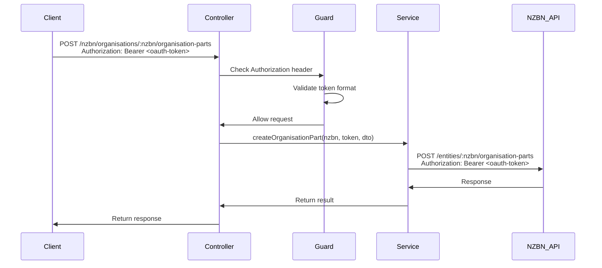

# NZBN Organisation Parts Backend Implementation

## Overview

Create a backend module for the NZBN "Maintain an Organisation Part" API (section 11) that handles POST, PUT, and DELETE operations. The implementation will support OAuth three-legged authentication by accepting OAuth tokens via Authorization headers and forwarding them to the NZBN API.

## Architecture

```
backend/src/nzbn/organisations/
├── dto/
│   ├── create-organisation-part.dto.ts
│   ├── update-organisation-part.dto.ts
│   └── organisation-part-response.dto.ts
├── interfaces/
│   └── nzbn-api.interface.ts
├── strategies/
│   └── oauth-token.strategy.ts
├── guards/
│   └── oauth-token.guard.ts
├── organisations.controller.ts
├── organisations.service.ts
└── organisations.module.ts
```

## Implementation Details

### 1. Configuration

**Files to modify:**

- `backend/src/config/configuration.ts` - Add NZBN API configuration
- `backend/src/config/config.service.ts` - Add getters for NZBN config

Add configuration for:

- `nzbn.apiUrl` - Base URL for NZBN API (default: https://api.business.govt.nz/sandbox)
- `nzbn.apiVersion` - API version path (optional, e.g., /v5)

### 2. OAuth Token Strategy

**File:** `backend/src/nzbn/organisations/strategies/oauth-token.strategy.ts`

Create a strategy that:

- Extracts OAuth token from `Authorization: Bearer <token>` header
- Stores token in request context for use by the service
- Does NOT validate the token (passes it through to NZBN API)

This is different from JWT strategy - it's a pass-through mechanism since the NZBN API will validate the token.

### 3. OAuth Token Guard

**File:** `backend/src/nzbn/organisations/guards/oauth-token.guard.ts`

Create a guard that:

- Uses the OAuth token strategy
- Ensures an Authorization header with Bearer token is present
- Rejects requests without valid Authorization header format

### 4. NZBN API Client Service

**File:** `backend/src/nzbn/organisations/organisations.service.ts`

Create a service similar to `issuance.service.ts` that:

- Uses Axios to make HTTP requests to NZBN API
- Accepts OAuth token as parameter for each request
- Sets up axios instance with base URL from config
- Adds request/response interceptors for logging
- Implements methods:
  - `createOrganisationPart(nzbn: string, token: string, data: CreateOrganisationPartDto)`
  - `updateOrganisationPart(nzbn: string, opn: string, token: string, data: UpdateOrganisationPartDto)`
  - `deleteOrganisationPart(nzbn: string, opn: string, token: string)`
- Handles error responses from NZBN API
- Returns appropriate error responses

**File:** `backend/src/nzbn/organisations/interfaces/nzbn-api.interface.ts`

Define TypeScript interfaces for:

- OrganisationPartRequest
- OrganisationPart
- OrganisationPartResponse
- ErrorResponse (if different from common error format)

### 5. DTOs (Data Transfer Objects)

**Files:**

- `backend/src/nzbn/organisations/dto/create-organisation-part.dto.ts`
- `backend/src/nzbn/organisations/dto/update-organisation-part.dto.ts`

Create DTOs using `class-validator` decorators based on the API schema from `definitions/nzbn.yaml`:

- Reference `OrganisationPartRequest` schema for POST
- Reference `OrganisationPart` schema for PUT
- Include validation decorators (@IsString, @IsOptional, @IsArray, etc.)

### 6. Controller

**File:** `backend/src/nzbn/organisations/organisations.controller.ts`

Create a controller with:

- `POST /nzbn/organisations/:nzbn/organisation-parts` - Create organisation part
- `PUT /nzbn/organisations/:nzbn/organisation-parts/:opn` - Update organisation part  
- `DELETE /nzbn/organisations/:nzbn/organisation-parts/:opn` - Delete organisation part

Features:

- Use `@UseGuards(OAuthTokenGuard)` on all endpoints
- Use `@Headers('authorization')` decorator or custom decorator to extract token
- Extract `nzbn` and `opn` from route parameters
- Validate request body using DTOs
- Call service methods with extracted token
- Handle responses and errors appropriately
- Add logging

### 7. Module

**File:** `backend/src/nzbn/organisations/organisations.module.ts`

Create a NestJS module that:

- Imports ConfigModule (already global)
- Declares and exports OrganisationsService
- Declares OrganisationsController
- Provides OAuthTokenStrategy and OAuthTokenGuard

### 8. App Module Integration

**File:** `backend/src/app.module.ts`

Add OrganisationsModule to imports array.

## Request/Response Flow



## Key Design Decisions

1. **Token Pass-through**: The backend acts as a proxy - it doesn't validate OAuth tokens, just forwards them to NZBN API
2. **Header-based Authentication**: OAuth tokens come via Authorization header (standard Bearer token format)
3. **Error Handling**: Map NZBN API errors to appropriate HTTP status codes
4. **Logging**: Follow existing pattern from issuance service for request/response logging
5. **Configuration**: Store NZBN API URL in environment variables for flexibility

## Environment Variables

Add to `.env`:

```
NZBN_API_URL=https://api.business.govt.nz/sandbox
NZBN_API_VERSION=/v5
```

## Testing Considerations

- Test with missing/invalid Authorization headers
- Test with valid OAuth tokens (integration tests)
- Test error handling for NZBN API errors
- Test validation of request DTOs