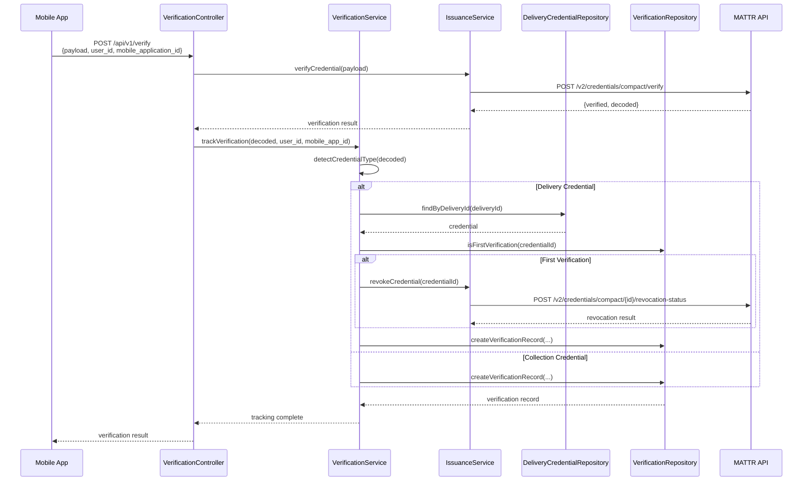

# Update Delivery Template and Verification Tracking

## Overview

This plan implements two main changes:

1. Ensure delivery credential service uses `MATTR_DELIVERY_CREDENTIAL_TEMPLATE_ID` from environment variables
2. Add verification tracking to the `/api/v1/verify` endpoint with `user_id` and `mobile_application_id` parameters, including automatic revocation of delivery credentials on first scan

## Architecture

The verification flow will work as follows:

## Implementation Steps

### 1. Database Migration

**File**: `backend/migrations/003_create_credential_verifications.sql`

Create a new table to track all credential verifications:

- `id` (UUID primary key)
- `credential_id` (VARCHAR) - MATTR credential ID
- `credential_type` (VARCHAR) - 'collection' or 'delivery'
- `user_id` (VARCHAR) - from mobile app
- `mobile_application_id` (VARCHAR) - from mobile app
- `verified` (BOOLEAN) - verification result
- `verified_at` (TIMESTAMP) - when verification occurred
- `created_at` (TIMESTAMP) - record creation time
- Indexes on `credential_id`, `credential_type`, `user_id`, `verified_at`

### 2. Verification Interfaces and DTOs

**File**: `backend/src/issuance/verification/interfaces/verification.interface.ts`

- `CredentialVerification` interface with all fields
- `CredentialType` type: 'collection' | 'delivery'

**File**: `backend/src/issuance/dto/verify-credential.dto.ts` (Update)

- Add `@IsOptional() @IsString() user_id?: string`
- Add `@IsOptional() @IsString() mobile_application_id?: string`

### 3. Verification Repository

**File**: `backend/src/issuance/verification/repositories/verification.repository.ts`

- PostgreSQL repository following the same pattern as `DeliveryCredentialRepository`
- Methods:
  - `create(verification: CredentialVerification): Promise<CredentialVerification>`
  - `findByCredentialId(credentialId: string): Promise<CredentialVerification[]>`
  - `isFirstVerification(credentialId: string): Promise<boolean>` - checks if this is the first verification for a credential

### 4. Verification Service

**File**: `backend/src/issuance/verification/services/verification.service.ts`

- `detectCredentialType(decoded: any): CredentialType | null` - checks for `deliveryId` or `collectionId` in decoded data
- `trackVerification(decoded: any, userId?: string, mobileAppId?: string, verified: boolean): Promise<void>`
  - Detects credential type
  - Finds credential in database using `deliveryId` or `collectionId`
  - For delivery credentials on first scan: calls revocation
  - Creates verification record

### 5. Update IssuanceService

**File**: `backend/src/issuance/issuance.service.ts`

- Add `revokeCredential(credentialId: string): Promise<void>` method
  - Calls `POST /v2/credentials/compact/{id}/revocation-status` to MATTR API
  - Handles errors appropriately

### 6. Update Repositories

**File**: `backend/src/issuance/delivery-credential/repositories/delivery-credential.repository.ts`

- Add `findByDeliveryId(deliveryId: string): Promise<DeliveryCredential | null>` method

**File**: `backend/src/issuance/collection-credential/repositories/collection-credential.repository.ts`

- Add `findByCollectionId(collectionId: string): Promise<CollectionCredential | null>` method (if not already exists)

### 7. Update VerificationController

**File**: `backend/src/issuance/verification.controller.ts`

- Update `verifyCredential` method to:
  - Accept `VerifyCredentialDto` instead of `any`
  - Extract `user_id` and `mobile_application_id` from DTO
  - Call `issuanceService.verifyCredential(body.payload)`
  - Call `verificationService.trackVerification()` with decoded data and tracking parameters
  - Return verification result

### 8. Create Verification Module

**File**: `backend/src/issuance/verification/verification.module.ts`

- Import `IssuanceModule`, `DeliveryCredentialModule`, `CollectionCredentialModule`
- Provide `VerificationService` and `VerificationRepository`
- Export `VerificationService`

### 9. Update AppModule

**File**: `backend/src/app.module.ts`

- Import `VerificationModule`

### 10. Verify Delivery Credential Template Configuration

**File**: `backend/src/issuance/delivery-credential/services/delivery-credential.service.ts`

- Verify it's using `configService.get<string>('matt.deliveryCredentialTemplateId', 'delivery-v1')` correctly
- The configuration already maps `MATTR_DELIVERY_CREDENTIAL_TEMPLATE_ID` from `.env` to `matt.deliveryCredentialTemplateId` in `configuration.ts`, so this should already work

## Key Implementation Details

### Credential Type Detection

The service will detect credential type by checking the decoded credential data:

- If `decoded.deliveryId` exists → Delivery Credential
- If `decoded.collectionId` exists → Collection Credential
- Otherwise → Unknown (log warning, still track verification)

### Revocation Logic

When a delivery credential is verified for the first time:

1. Find the credential in database using `deliveryId` from decoded data
2. Check if this is the first verification using `isFirstVerification(credentialId)`
3. If first verification, call `issuanceService.revokeCredential(credentialId)`
4. Create verification record regardless of revocation status

### Error Handling

- If credential type cannot be determined, log warning but still track verification
- If credential not found in database, log warning but still track verification
- If revocation fails, log error but still create verification record
- All errors should be logged but not fail the verification response

## Files to Create

1. `backend/migrations/003_create_credential_verifications.sql`
2. `backend/src/issuance/verification/interfaces/verification.interface.ts`
3. `backend/src/issuance/verification/repositories/verification.repository.ts`
4. `backend/src/issuance/verification/services/verification.service.ts`
5. `backend/src/issuance/verification/verification.module.ts`

## Files to Modify

1. `backend/src/issuance/dto/verify-credential.dto.ts` - Add user_id and mobile_application_id
2. `backend/src/issuance/issuance.service.ts` - Add revokeCredential method
3. `backend/src/issuance/verification.controller.ts` - Update to use DTO and tracking service
4. `backend/src/issuance/delivery-credential/repositories/delivery-credential.repository.ts` - Add findByDeliveryId
5. `backend/src/issuance/collection-credential/repositories/collection-credential.repository.ts` - Add findByCollectionId (if needed)
6. `backend/src/app.module.ts` - Import VerificationModule

## Testing Considerations

- Test verification tracking with both collection and delivery credentials
- Test first-time delivery credential verification triggers revocation
- Test subsequent delivery credential verifications do not trigger revocation
- Test verification tracking works without user_id/mobile_application_id (optional parameters)
- Test error handling when credential not found in database
- Test error handling when revocation fails